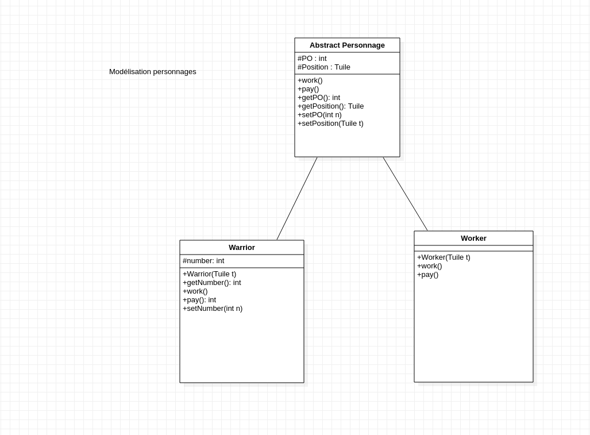
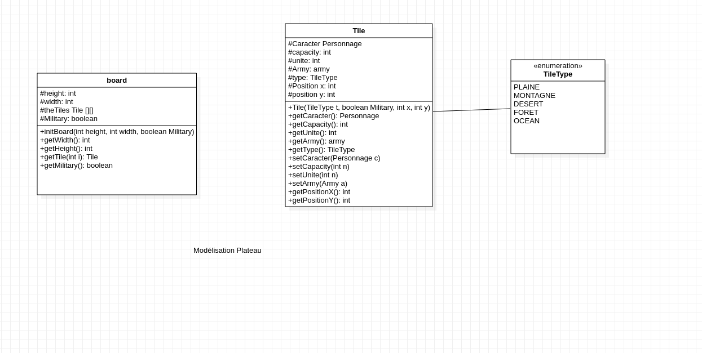
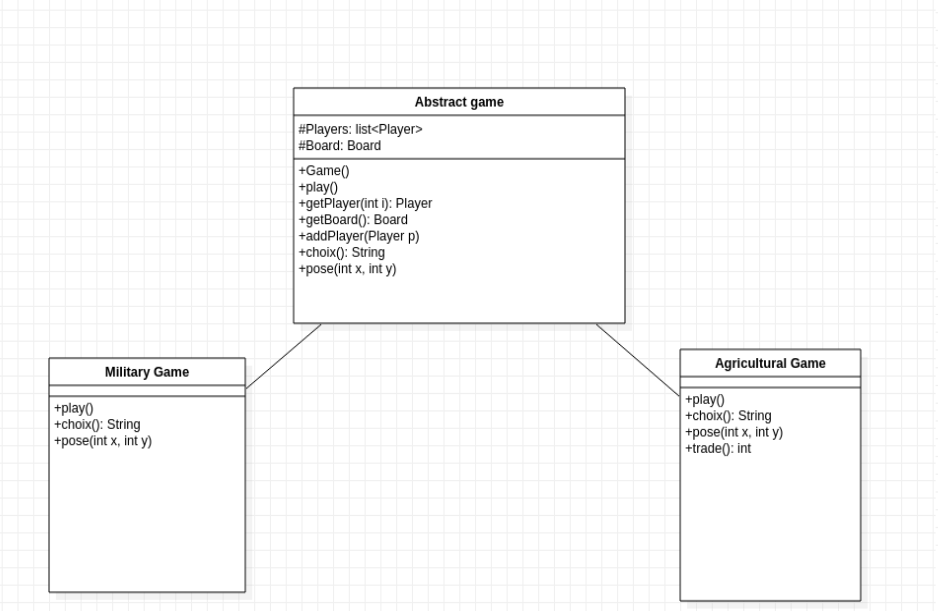
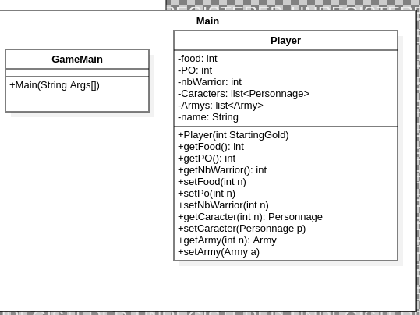

# l2s4-projet-2021

Vous devez *forker* ce projet dans votre espace de travail Gitlab (bouton `Fork`) et vidéo sur le [portail](https://www.fil.univ-lille1.fr/portail/index.php?dipl=L&sem=S4&ue=Projet&label=Documents)

Une fois cela réalisé supprimer ces premières lignes et remplissez les noms des membres de votre équipe.

# Equipe

- Maxime DERONNE
- Ibrahima-Sambegou DIALLO

# Sujet

[Le sujet 2021](https://www.fil.univ-lille1.fr/portail/index.php?dipl=L&sem=S4&ue=Projet&label=Documents)

# Livrables

## Livrable 1

### Atteinte des objectifs

Modélisation des personnages via un schéma UML.  

Nous avons créé trois classes 
	La classe Personnage : cette classe est une classe abstraite qui permet à certaines classes d'hériter des méthodes et attributs communs de type personnage que nous avons dans le sujet à savoir: les guerriers (Warrior) et les travailleurs (Worker).
	
	
Trouver la version final dans Livrable1Final.png

### Difficultés restant à résoudre
	Modélisation des Armées 
	
## Livrable 2

### Atteinte des objectifs

Remodélisation des Personnages en ajoutant une classe Army 
	on a rajouté la classe Army qui prend une liste de guerriers dans les Personnages
	
Modélisation Plateau:  
	Modélisation de la classe enum TileType  
	Modélisation de la classe Tile ayant pour type TileType  
	Modélisation de la classe Board qui représente un tableau de Tile  
	

Trouver la version final dans Livrable2Final.png
### Difficultés restant à résoudre
	Aucune à resoudre tout a été fait.

## Livrable 3

### Atteinte des objectifs

Modélisation des Jeux:  
	Nous avons Modélisé trois classes:  
	D'abord la classe abstraite qui est AbstractGame pour que les deux autres puissent en 		heriter.  
	Puis les deux classes MilitaryGame (le jeux millitaire) et AgriculturalGame (le jeux 		agricole).  
	
Trouver la version final dans Livrable3Final.png

### Difficultés restant à résoudre

## Livrable 4

### Atteinte des objectifs

Modélisation Player et GameMain:  
	La classe GameMain(creer pour le test) est une classe qui nous  permettra l'implentation des deux main du jeux  
	A savoir MainAgricole et Warmain  
	 

Trouver la version final dans Livrable4Final.png

### Difficultés restant à résoudre

Attributs et fonctions dans Players Manquant

# Journal de bord

## Semaine 1
Nous avons fait la modélisation des personnages. L'idée était de créer une classe abstraite afin de pouvoir créer différents personnages.
## Semaine 2

Nous nous sommes occupés de la modélisation de plateau et aussi refait la modélisation de personnage en ajoutant une armée qui pourra intéragir avec les différents soldats.
Pour les types de tuiles nous avons fait un type enum afin d'avoir la possibilité de rajouter de nouveau type.

## Semaine 3

Nous avons revu quelques points sur la modélisation du plateau car des attributs étaient inutiles (le cas de unité).

## Semaine 4

On a réfléchi sur la modélisation de plateau et des différents jeux avec les actions possibles.

## Semaine 5

Pour la modélisation des jeux on a pensé à créer des fonctions pour les choix et la pose d'un personnage.

## Semaine 6

Nous avons réfléchis sur la modélisation du joueur et du main.

## Semaine 7

Livrable 4

## Semaine 8

Début des implémentations d'abord avec Board et les Personnages pas totalement fini (Par exemple pour board il manquait les fonctions pour l'initialisation du terrain)
## Semaine 9

Nous avons continué sur l'implémentation en ajoutant de nouvelles méthodes dans tile Type et les méthodes pay et work pour les personnages.

## Semaine 10

L'implémentation de le partie plateau est fini ainsi que pour work et pay. 
Nous avons aussi créer la classe Player et amené des changements dans les personnages afin qu'il soit lié à un joueur lors de leur création. De ce fait on a aussi fait des changements pour les test des personnages.
On a fait les tests pour les différentes classes et aussi la documentation.

## Semaine 11

Pour les deux dernières semaines il fallait terminer les deux classes games avec la fonction play il y a eu aussi beaucoup de changement pour certaines classes ce qui a changé aussi la modélisation globale de l'UML. Par exemple dans worker l'ajout d'un attribut ressource qui stocker les ressources à chaque fin de tour pour ensuite les échanger. On a aussi mis deux paramètres dans les classes games afin de pouvoir modifier la taille plateau si on veut.
On a aussi créer deux classes main pour les deux jeux.
La pensée est la même pour les deux. Lors de l'éxécution d'une partie on met en paramètre le nom des joueurs qui seront ensuite ajouté à la partie.
Documentation et test unitaire de Player fait.

## Semaine 12

Pour la dernière semaine on devait finalisé le projet en faisant un makefile permettant de créer les jar, génerer la doc et nettoyer après.
On a aussi complété le readme.

# Fonctionement du Makefile

## 1)Lancement des Jeux:  

### Pour le jeu Agricole: 
	Assurer vous que vous ete bien dans le dossier Game
	Faite ------> make agricole.jar
	Puis ------> java -jar jar/agricole.jar < nom des joueurs >

### Pour le jeu Guerre: 
	Assurer vous que vous ete bien dans le dossier Game
	Faite ------> make guerre.jar
	Puis ------> java -jar jar/guerre.jar < nom des joueurs >

## 2)Generation de la documentation: 
Il suffit de faire un < make doc >
Allez dans le dossier Doc
Puis se diriger sur site index.html (Toutes les informations sur la modelisation sont dessus ) 
	

## 3)Nettoyage :
Pour nettoyer tous : faire un < make clean > et tous les dossier generer seront effacer 

